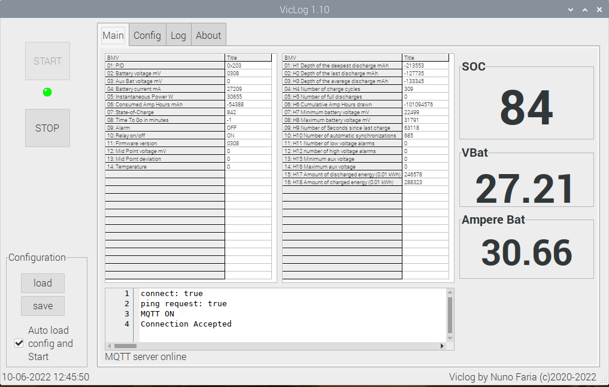
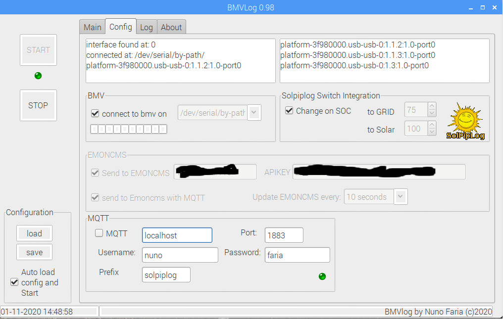

# bmvlog

logger for Victrons BMV Battery Monitors on Raspberry

Sends data per MQTT to your local broker ( for Home Automation for example ) and to your local Emoncms account.
Interfaces with solpiplog to change the inverter to switch to grid or solar, based on predifined SOC values.
## Instalation
download 
create a folder on your raspberry with explorer or per commandline ''' mkdir bmv '''
copy downloaded zip to bmv folder
unzip the file
execute ''' setup.sh '''

## [Values sent over MQTT](/docs/mqttvalues.md)
## Appearance

